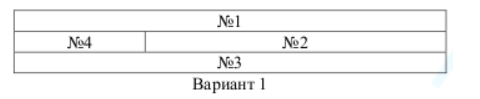
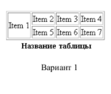
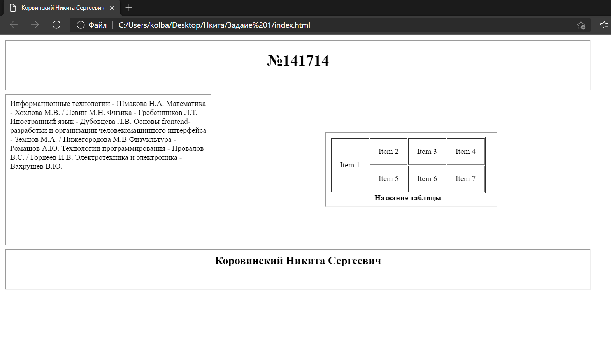
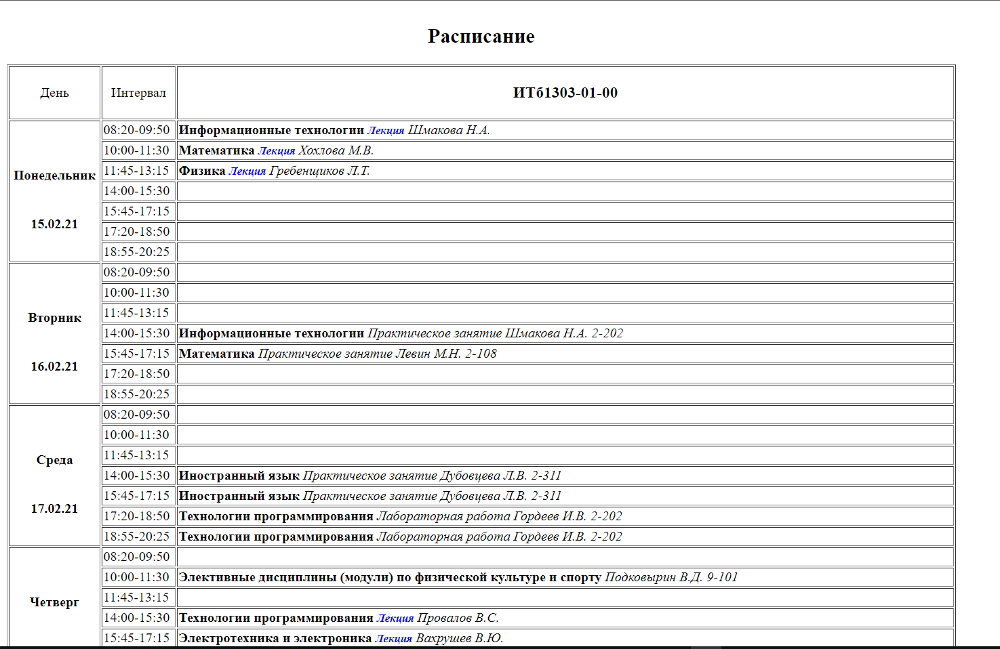
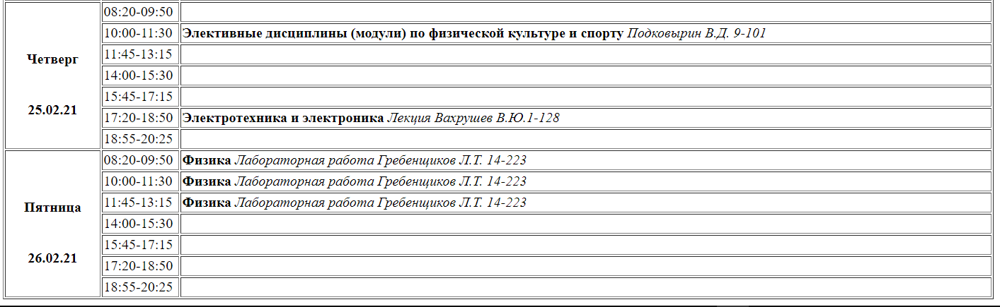

МИНИСТЕРСТВО НАУКИ И ВЫСШЕГО ОБРАЗОВАНИЯ
РОССИЙСКОЙ ФЕДЕРАЦИИ

ФЕДЕРАЛЬНОЕ ГОСУДАРСТВЕННОЕ БЮДЖЕТНОЕ ОБРАЗОВАТЕЛЬНОЕ УЧРЕЖДЕНИЕ ВЫСШЕГО ОБРАЗОВАНИЯ
«ВЯТСКИЙ ГОСУДАРСТВЕННЫЙ УНИВЕРСИТЕТ»

Институт математики и информационных систем

Факультет автоматики и вычислительной техники

Кафедра систем автоматизации управления

Дата сдачи на проверку:

«18  »   февраля     2021 г.

Проверено:

«\_\_\_» \_\_\_\_\_\_\_\_\_\_ 2021 г.

**Методы формирования html5 документов**

Отчет по лабораторной работе № 1
по дисциплине

«Основы frontend-разработки и организации человеко-машинного интерфейса»

Вариант 1

Разработал студент гр. ИТб-1303-01-00	        \_\_\_\_\_\_\_\_\_\_\_\_\_\_\_\_\_ /Коровинский Н.С./

(Подпись)

Руководитель ст. преподаватель		   \_\_\_\_\_\_\_\_\_\_\_\_\_\_\_\_\_ /Земцов М.А./

(Подпись)

Работа защищена с оценкой			«\_\_\_\_\_\_\_\_\_\_\_» «\_\_\_» \_\_\_\_\_\_\_\_\_\_ 2021 г.

Киров 2021

Цель лабораторной работы: изучение методов формирования html5 документов на стороне клиента

Задачи лабораторной работы:

1. Организовать рабочее пространство и процессы разработки html5 документов.
1. Изучить структуру html5 документа
1. Исследовать функциональные возможности инструментов разработчика на стороне браузера
1. Изучить типовые элементы структуры html5 документа
1. Составить отчет по выполненным задачам
1. Защитить лабораторную работу

Задание 1.

Создайте HTML-страницу разделенную на фреймы в соответствии с номером варианта. В качестве заголовка страницы используйте ваше имя, отчество и фамилию*.*

Рис.1

Рис.2

Рис.3
Задание 2.

Изучить типовые элементы структуры html5 документа

1)Тег 
 в HTML определяет абзац

2)<h1> - заголовок первого уровня;

<h2> - заголовок второго уровня;

<h3> - заголовок третьего уровня;

<h4> - заголовок четвертого уровня;

<h5> - заголовок пятого уровня;

<h6> - заголовок шестого уровня

\3) Тег <code> в HTML используется для обозначения текста как программного кода

\4) <kbd> представляет ввод с клавиатуры, хотя StackOverflow отображает это как настоящие ключи.

<samp> представляет образец вывода компьютера, и первоначально компьютеры были одноместными :)

<code> представляет входной код программирования, и подавляющее большинство языков программирования предназначены для предположения monospaced editor font-за исключением книги C++, которая почему-то предпочитает переменную ширину и некоторые породы Python. Обратите внимание, что <code> - это строчный элемент, а <pre> используется для разметки блочного уровня (т. е. абзацев) кода.Тот факт, что рендеринг по умолчанию одинаковый, не означает, что вы не можете назначить свои собственные стили рендеринга, как это делает StackOverflow.

\5) Браузеры обычно отображают содержимое HTML тега цитаты <q> в кавычках

\6) Тег   указывает место переноса строки в тексте HTML страницы

Тег 
 используется в HTML для вывода горизонтальной линии - разделителя.

\7) строчные элементы 

\8) для логического выделение важного участка текста жирным шрифтом используйте тег [<strong>](https://guruweba.com/html/teg-strong-html-zhirnyy-shrift-logicheskoe-vydelenie-teksta/)

Тег <b> в HTML используется для выделения фрагмента текста жирным.

Задание 3 

Сделать расписание на 2 недели.

Результат (рис. 4)

Рис.4

Вывод:

Мы познакомились с частью базовых функций HTML.
